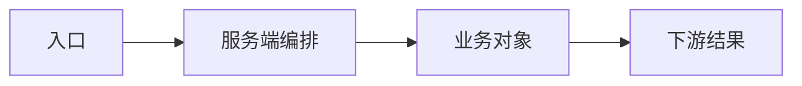

# <需求名称> 系统分析

> 分析状态：进行中
> 本文定位：面向当前项目的初步设计，说明目标如何落到对象、模块、接口和页面；具体代码分支下沉到详细设计。

## 1. 业务目标与范围

- 用户场景 / 触发条件：
- 目标结果：
- 非目标：
- 验收信号：

## 2. 现状与差异

| 范围 | 当前事实 | 需求差异 | 依据 |
|---|---|---|---|
| <代码 / 模型 / 运行态> | <现在是什么> | <缺什么> | <文件、接口、模型或运行态证据> |

## 3. 领域对象与关系（按需）

| 对象 / 模型 | 角色 | 关键字段或关联 | 上游 / 下游 |
|---|---|---|---|
| <业务对象> | <配置源 / 运行结果 / 中间对象> | <字段、主子表、引用关系> | <对象或模块> |

关系说明：

## 4. 端到端实现路径

```text
<用户或外部事件> -> <Admin/移动端入口> -> <API/Event> -> <服务端编排> -> <对象读写> -> <下游结果>
```

| 步骤 | 实际入口 / 模块 | 处理或数据变化 | 输出给谁 |
|---|---|---|---|
| 1 | <页面、接口、事件> | <动作> | <下游> |

## 5. 各端与上下游改动（按需）

### 服务端

- 入口：
- 服务 / Hook / Event / MQ：
- 读写对象：
- 关键校验和事务：

### Admin

- 页面 / 路由：
- 列表、表单、弹窗、详情或按钮：
- 接口契约：
- 成功、失败、空数据和状态变化：

### 移动端或其他消费端

- 是否涉及：
- 调用契约 / 字段 / 状态兼容：

### 上下游模块

- 上游配置或数据来源：
- 下游消费、回调、报表或通知：

## 6. 状态、权限与异常

- 关键状态流转：
- 权限 / 开放对象：
- 空数据、重复、异步失败和历史兼容：

## 7. 逻辑图（按需）

### Mermaid



### draw.io

- 源文件：`<docs/images/src/<name>.drawio>`
- 预览图：`<可选路径>`
- 图表达：<调用链 / 状态 / 数据流 / 对象关系>

## 8. 初步实现方案与详细设计映射

| 初步方案 | 涉及入口 / 文件 / 模块 | 详细设计章节 | 验收信号 |
|---|---|---|---|
| <方案> | <实际位置> | <章节链接> | <信号> |

## 9. Plan 已确认结论与阻断

| 事项 | 结论 | 依据 | 状态 |
|---|---|---|---|
| <没有时写“无”> | <结论> | <用户回答或事实> | 已确认 / 阻断 |
