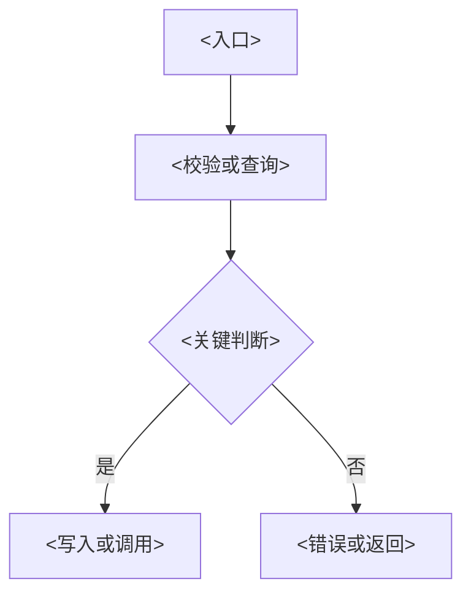

# <工单号> <需求名称> 详细设计

> 仅在跨模块契约、复杂数据流、权限、迁移、并发或回滚需要实现级设计时创建。写到可直接实现：保留关键代码或完整伪代码；较长流程必须保留 Mermaid。删除不适用章节。

## 设计范围

- 目标：<目标>
- 依据：<系统分析或需求章节>
- 不处理：<范围>

## 模块与契约

| 模块 / 接口 | 输入 | 输出 | 依赖 | 异常语义 |
|-------------|------|------|------|----------|
| <模块> | <输入> | <输出> | <依赖> | <异常> |

## 数据、权限与流程

记录字段口径、读写路径、权限过滤和关键流程。没有复杂边界时删除本节。



## 关键实现

为每个复杂模块保留关键代码片段，或写覆盖全部关键分支的完整伪代码；不要只写标题或泛化步骤。

```text
<输入> -> 校验前置条件
if <异常条件>:
  return <错误语义>
<读取或计算>
<写入或调用>
return <结果>
```

## 性能、兼容与回滚

记录批量策略、事务、旧数据兼容和回滚方案。没有相关风险时删除本节。

## 验收约束

- <能证明设计正确的信号>
